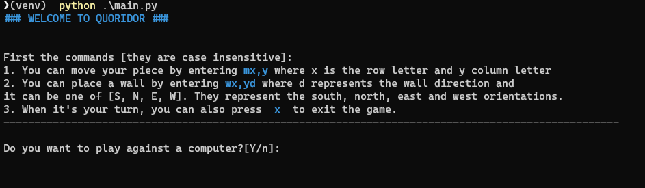
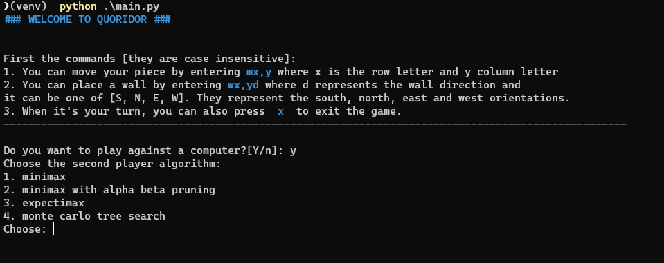
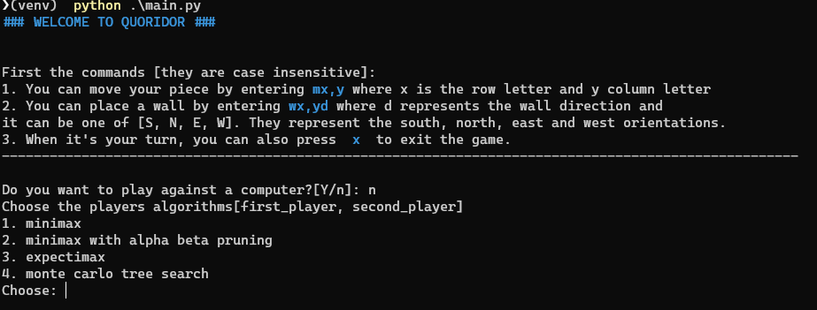
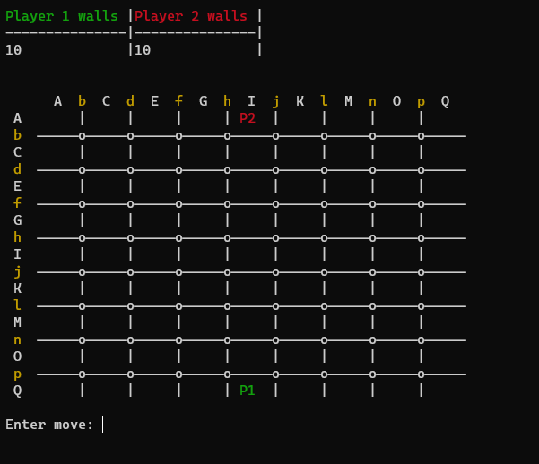

# quoridor

### Description

You can read the rules of the game [here](https://en.wikipedia.org/wiki/Quoridor).

This project contains bots for the game quoridor written in four different ways:

* minimax
* minimax with alpha-beta pruning
* expectimax
* monte carlo tree search

### Running the project

It is recommended that you run this project from a virtual environment.

In order to run the project, you need to have [numpy](https://numpy.org/) installed. After you've done that, open the
terminal and position yourself in the project root directory, and simply run `python main.py`.

### Instructions

**Note:** All commands are case-insensitive.

When you start the program, you will encounter the following:

Here, you can choose whether you want to play against a bot or you want to watch two bots play against each other (which
I do not recommend).

If you choose to play against a bot, you only choose one algorithm

If, however, you choose a simulation, you need to choose algorithms for both bots:

After that, you can play the game. The board looks like this:

If you chose a simulation, you cannot enter any moves, you can just sit and watch. If you chose to play, you will
control the player one (green P1). Each turn, you can either:

* move your piece or
* place a wall.

#### Moving the piece

If you want to move your piece, simply enter `mx,y`, where `x` represents the row and `y` represents the column of the
field you want to move to. The rows and columns where you can move your piece are white.

#### Placing the wall

If you want to place the wall, simply enter `wx,yd`, where `x` represents the row and `y` the column of the walls
starting piece. The `d` represents the direction:

* if you want a vertical wall, the direction can be either `s`(south) or `n`(north)
* if you want a horizontal wall, the direction can be either `e`(east) or `w`(west)

